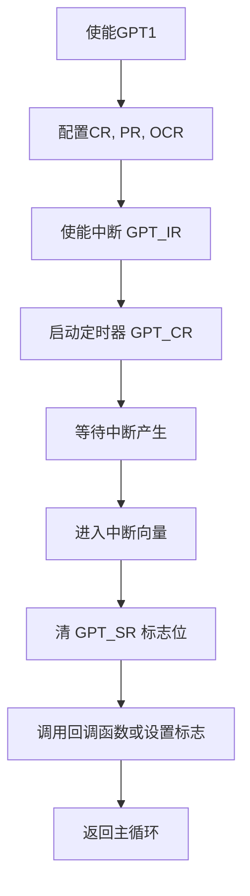

好的，我们继续本周的学习内容，从 **GPT 定时器（General Purpose Timer）** 开始。

---

## ✅ 1. GPT 定时器简介

GPT 是 **通用定时器**（General Purpose Timer）的缩写，广泛应用于单片机和嵌入式 SoC（如 i.MX6ULL）中，常用于：

* 精确延时（延时函数）
* 周期定时（比如 LED 闪烁）
* 超时检测
* PWM 输出（某些 GPT 支持）
* 中断事件触发

在 **NXP 的 i.MX6ULL** 中，有多个 GPT 模块，例如 GPT1、GPT2，属于外设之一。

---

## 🧠 2. GPT 定时器的基本原理

GPT 是通过对输入时钟进行分频，然后将值加载到计数器中，计数器自动递增，当达到设定值时触发事件（如中断）。

### 核心寄存器（以 i.MX6ULL 为例）：

| 寄存器名           | 功能说明            |
| -------------- | --------------- |
| `GPT_CR`       | 控制寄存器：启动、停止、复位等 |
| `GPT_PR`       | 预分频寄存器：决定定时精度   |
| `GPT_SR`       | 状态寄存器：中断标志位     |
| `GPT_IR`       | 中断使能寄存器         |
| `GPT_OCR1/2/3` | 比较寄存器，定时目标值     |
| `GPT_CNT`      | 当前计数值寄存器        |

---

## 🛠️ 3. GPT 定时器延时的设置流程（裸机）

下面是一个常见的流程来使用 GPT 做延时功能：

### 步骤：

1. **使能 GPT 时钟（IOMUX/CCM）**
2. **配置 GPT 控制寄存器：如时钟源、复位、启用**
3. **设置预分频值（控制频率）**
4. **设置 OCR 比较值**
5. **启动定时器**
6. **轮询 `GPT_SR` 状态寄存器，等待溢出或 OCR 匹配**
7. **清除中断标志**

---

## 🔧 4. 裸机代码示例（延时函数）

假设 GPT1 定时器时钟为 66MHz，我们设置为 1ms 延时单位：

```c
#include "imx6ul.h"

#define GPT1_BASE  (0x2098000)
#define GPT_CR     (*(volatile unsigned int*)(GPT1_BASE + 0x00))
#define GPT_PR     (*(volatile unsigned int*)(GPT1_BASE + 0x04))
#define GPT_SR     (*(volatile unsigned int*)(GPT1_BASE + 0x08))
#define GPT_CNT    (*(volatile unsigned int*)(GPT1_BASE + 0x24))
#define GPT_OCR1   (*(volatile unsigned int*)(GPT1_BASE + 0x10))

void gpt1_init(void) {
    // 使能 GPT1 模块时钟（略，依赖 CCM 模块）
    
    GPT_CR = (1 << 15);    // 软复位
    while (GPT_CR & (1 << 15));

    GPT_CR = (1 << 6);     // 时钟源为66MHz
    GPT_PR = 65;           // 预分频 = 66MHz / (65+1) = 1MHz（1us一次）

    GPT_CR |= (1 << 0);    // 使能 GPT
}

void delay_ms(unsigned int ms) {
    GPT_CNT = 0;
    while (GPT_CNT < ms * 1000);  // 1us 计一次，等待 ms*1000次
}
```

> 你也可以改写成中断模式的定时器，配合 GPT\_IR 和 GPT\_SR 寄存器。

---

## 📦 5. GPT Makefile 示例

```makefile
all:
	arm-linux-gnueabihf-gcc -c start.S -o start.o
	arm-linux-gnueabihf-gcc -c main.c -o main.o
	arm-linux-gnueabihf-ld -T linker.lds start.o main.o -o main.elf
	arm-linux-gnueabihf-objcopy -O binary main.elf main.bin

clean:
	rm -f *.o *.elf *.bin
```

---

## 📈 6. 中断处理流程图（GPT 示例）



---

## 🧠 7. 重点总结：

* GPT 是一个**高精度、低资源消耗**的通用定时器，非常适合裸机程序和 RTOS 任务调度。
* GPT 可用于：**延时函数、定时中断、PWM 基础**。
* 和 Linux 驱动开发中的 timer、hrtimer 概念类似，但底层硬件驱动要手动配置寄存器。

---

如果你想我再补一份：
✅ `中断模式延时 + IRQ 向量表 + 启动文件 + 全套 Makefile`，我可以继续提供。

需要我继续吗？你更希望哪种风格？"图解 + 程序解析" 还是 "纯程序模板 + 手册"?
